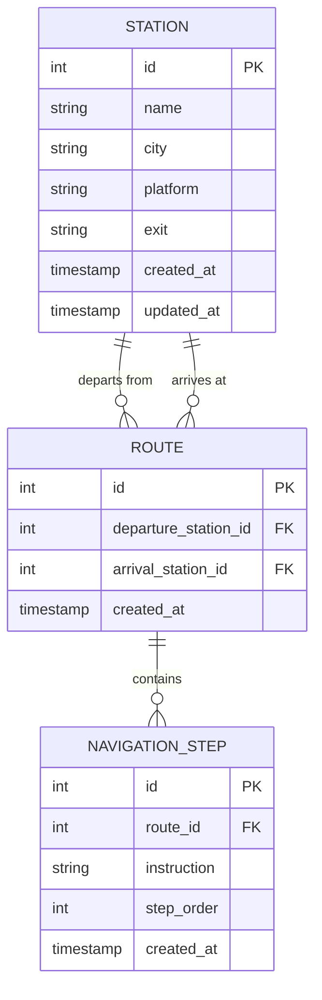

```mermaid

erDiagram
    STATION {
        int id PK
        string name
        string city
        string platform
        string exit
        timestamp created_at
        timestamp updated_at
    }

    ROUTE {
        int id PK
        int departure_station_id FK
        int arrival_station_id FK
        timestamp created_at
    }

    NAVIGATION_STEP {
        int id PK
        int route_id FK
        string instruction
        int step_order
        timestamp created_at
    }

    STATION ||--o{ ROUTE : "departs from"
    STATION ||--o{ ROUTE : "arrives at"
    ROUTE ||--o{ NAVIGATION_STEP : "contains"
```