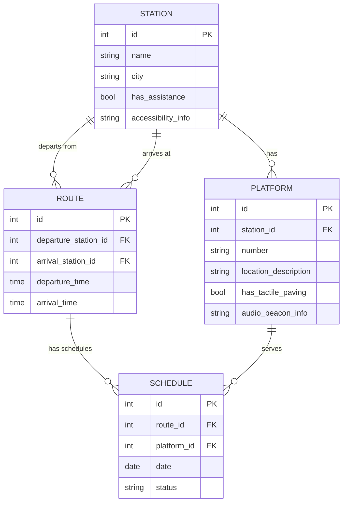

```mermaid
erDiagram
    STATION {
        int id PK
        string name
        string city
        bool has_assistance
        string accessibility_info
    }

    ROUTE {
        int id PK
        int departure_station_id FK
        int arrival_station_id FK
        time departure_time
        time arrival_time
    }

    PLATFORM {
        int id PK
        int station_id FK
        string number
        string location_description
        bool has_tactile_paving
        string audio_beacon_info
    }

    SCHEDULE {
        int id PK
        int route_id FK
        int platform_id FK
        date date
        string status
    }

    STATION ||--o{ ROUTE : "departs from"
    STATION ||--o{ ROUTE : "arrives at"
    STATION ||--o{ PLATFORM : "has"
    ROUTE ||--o{ SCHEDULE : "has schedules"
    PLATFORM ||--o{ SCHEDULE : "serves"
```