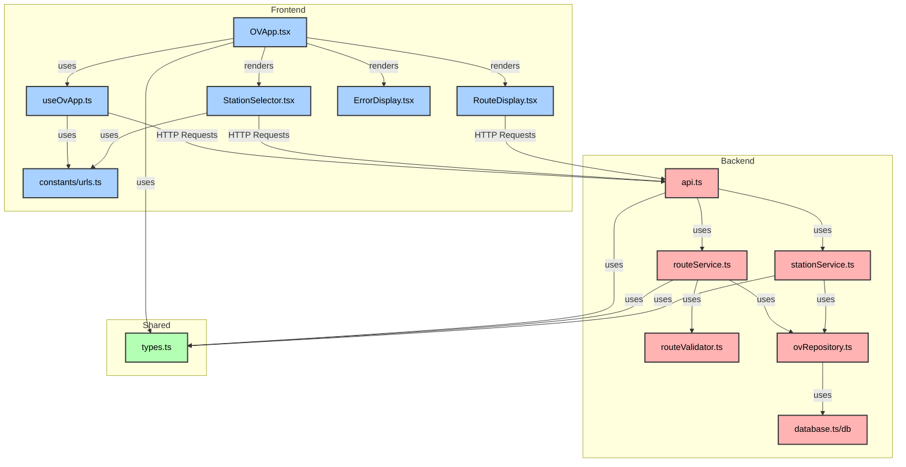

```mermaid
graph TD
    subgraph Frontend
        OVApp[OVApp.tsx] --> |uses| useOvApp[useOvApp.ts]
        OVApp --> |renders| StationSelector[StationSelector.tsx]
        OVApp --> |renders| RouteDisplay[RouteDisplay.tsx]
        OVApp --> |renders| ErrorDisplay[ErrorDisplay.tsx]
        useOvApp --> |uses| API_BASE_URL[constants/urls.ts]
        StationSelector --> |uses| API_BASE_URL
    end

    subgraph Backend
        API[api.ts] --> |uses| RouteService[routeService.ts]
        API --> |uses| StationService[stationService.ts]
        RouteService --> |uses| RouteValidator[routeValidator.ts]
        RouteService --> |uses| OVRepository[ovRepository.ts]
        StationService --> |uses| OVRepository
        OVRepository --> |uses| Database[database.ts/db]
    end

    subgraph Shared
        Types[types.ts]
    end

    useOvApp --> |HTTP Requests| API
    StationSelector --> |HTTP Requests| API
    RouteDisplay --> |HTTP Requests| API
    
    OVApp --> |uses| Types
    API --> |uses| Types
    RouteService --> |uses| Types
    StationService --> |uses| Types

    classDef frontend fill:#a8d1ff,stroke:#333,stroke-width:2px,color:#000;
    classDef backend fill:#ffb3b3,stroke:#333,stroke-width:2px,color:#000;
    classDef shared fill:#b3ffb3,stroke:#333,stroke-width:2px,color:#000;

    class OVApp,useOvApp,StationSelector,RouteDisplay,ErrorDisplay,API_BASE_URL frontend;
    class API,RouteService,StationService,RouteValidator,OVRepository,Database backend;
    class Types shared;
```
