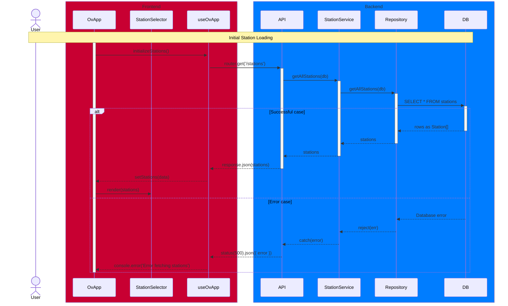

```mermaid
sequenceDiagram
    actor User
    box rgb(200,0,50) Frontend
        participant OvApp
        participant StationSelector
        participant useOvApp
    end
    
    box rgb(0,125,255) Backend
        participant API
        participant StationService
        participant Repository
        participant DB
    end

    Note over User,DB: Initial Station Loading
    
    activate OvApp
    OvApp->>+useOvApp: initializeStations()
    useOvApp->>+API: router.get('/stations')
    API->>+StationService: getAllStations(db)
    StationService->>+Repository: getAllStations(db)
    Repository->>+DB: SELECT * FROM stations
    
    alt Successful case
        DB-->>-Repository: rows as Station[]
        Repository-->>-StationService: stations
        StationService-->>-API: stations
        API-->>-useOvApp: response.json(stations)
        useOvApp-->>OvApp: setStations(data)
        OvApp->>StationSelector: render(stations)
    else Error case
        DB-->>Repository: Database error
        Repository-->>StationService: reject(err)
        StationService-->>API: catch(error)
        API-->>useOvApp: status(500).json({ error })
        useOvApp-->>OvApp: console.error('Error fetching stations')
    end
    deactivate OvApp
```