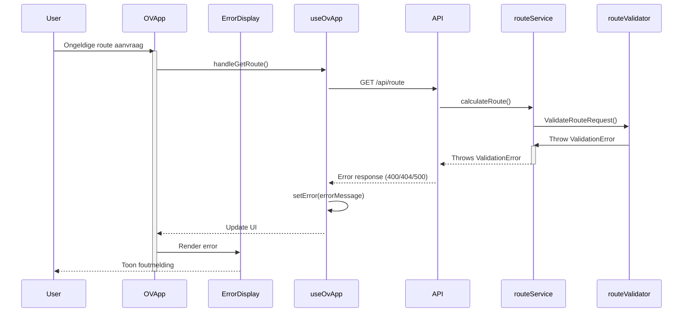

```mermaid
sequenceDiagram
    participant User
    participant OVApp 
    participant ErrorDisplay
    participant useOvApp
    participant API
    participant routeService
    participant routeValidator

    User->>OVApp: Ongeldige route aanvraag
    activate OVApp
    OVApp->>useOvApp: handleGetRoute()
    activate useOvApp
    useOvApp->>API: GET /api/route
    activate API
    API->>routeService: calculateRoute()
    routeService->>routeValidator: ValidateRouteRequest()
    routeValidator->>routeService: Throw ValidationError
    activate routeService
    routeService-->>API: Throws ValidationError
    deactivate routeService
    API-->>useOvApp: Error response (400/404/500)
    useOvApp->>useOvApp: setError(errorMessage)
    useOvApp-->>OVApp: Update UI
    OVApp->>ErrorDisplay: Render error
    ErrorDisplay-->>User: Toon foutmelding
    deactivate OVApp
```
