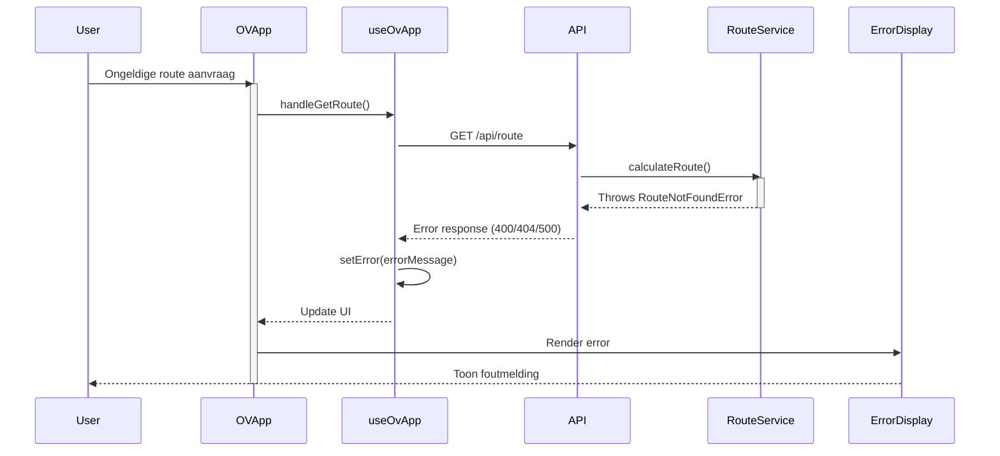

```mermaid
sequenceDiagram
    participant User
    participant OVApp
    participant useOvApp
    participant API
    participant RouteService
    participant ErrorDisplay

    User->>OVApp: Ongeldige route aanvraag
    activate OVApp
    OVApp->>useOvApp: handleGetRoute()
    activate useOvApp
    useOvApp->>API: GET /api/route
    activate API
    API->>RouteService: calculateRoute()
    activate RouteService
    RouteService-->>API: Throws RouteNotFoundError
    deactivate RouteService
    API-->>useOvApp: Error response (400/404/500)
    useOvApp->>useOvApp: setError(errorMessage)
    useOvApp-->>OVApp: Update UI
    OVApp->>ErrorDisplay: Render error
    ErrorDisplay-->>User: Toon foutmelding
    deactivate OVApp
```
