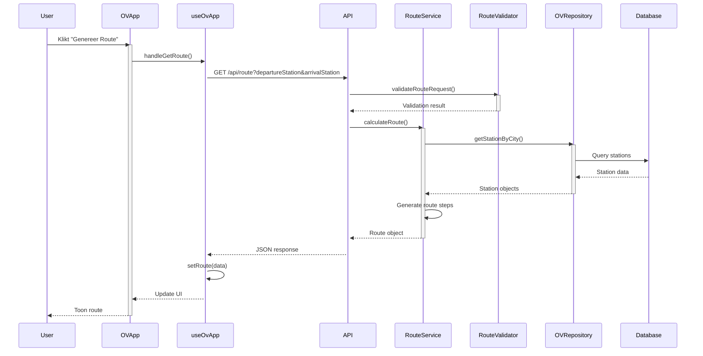

```mermaid
sequenceDiagram
    participant User
    participant OVApp
    participant useOvApp
    participant API
    participant RouteService
    participant RouteValidator
    participant OVRepository
    participant Database

    User->>OVApp: Klikt "Genereer Route"
    activate OVApp
    OVApp->>useOvApp: handleGetRoute()
    activate useOvApp
    useOvApp->>API: GET /api/route?departureStation&arrivalStation
    activate API
    API->>RouteValidator: validateRouteRequest()
    activate RouteValidator
    RouteValidator-->>API: Validation result
    deactivate RouteValidator
    
    API->>RouteService: calculateRoute()
    activate RouteService
    RouteService->>OVRepository: getStationByCity()
    activate OVRepository
    OVRepository->>Database: Query stations
    Database-->>OVRepository: Station data
    OVRepository-->>RouteService: Station objects
    deactivate OVRepository
    
    RouteService->>RouteService: Generate route steps
    RouteService-->>API: Route object
    deactivate RouteService
    
    API-->>useOvApp: JSON response
    useOvApp->>useOvApp: setRoute(data)
    useOvApp-->>OVApp: Update UI
    OVApp-->>User: Toon route
    deactivate OVApp
```
