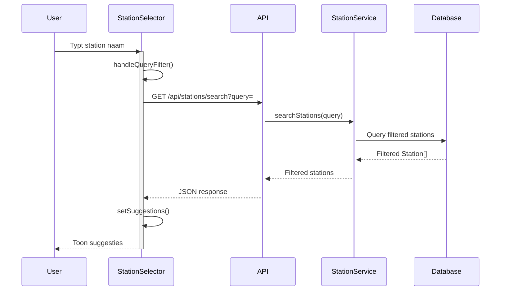

```mermaid
sequenceDiagram
    participant User
    participant StationSelector
    participant API
    participant StationService
    participant Database

    User->>StationSelector: Typt station naam
    activate StationSelector
    StationSelector->>StationSelector: handleQueryFilter()
    StationSelector->>API: GET /api/stations/search?query=
    activate API
    API->>StationService: searchStations(query)
    activate StationService
    StationService->>Database: Query filtered stations
    Database-->>StationService: Filtered Station[]
    StationService-->>API: Filtered stations
    API-->>StationSelector: JSON response
    StationSelector->>StationSelector: setSuggestions()
    StationSelector-->>User: Toon suggesties
    deactivate StationSelector
```
