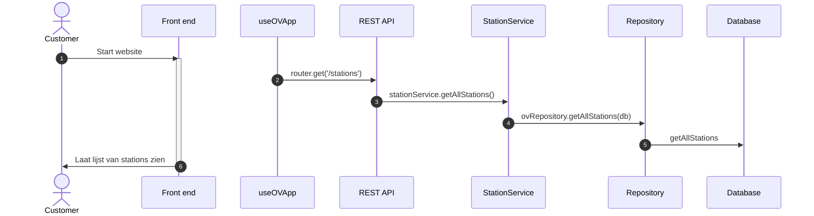

```mermaid
sequenceDiagram
    autonumber
    actor C as Customer
    participant WS as Front end
    participant U as useOVApp
    participant WH as REST API
    participant SS as StationService
    participant Repo as Repository
    participant DB as Database

    C->>WS: Start website
    activate WS
    U->>WH: router.get('/stations')
    WH->>SS: stationService.getAllStations()
    SS->>Repo: ovRepository.getAllStations(db)
    Repo->>DB: getAllStations 
    WS->>C: Laat lijst van stations zien
    deactivate WS
```